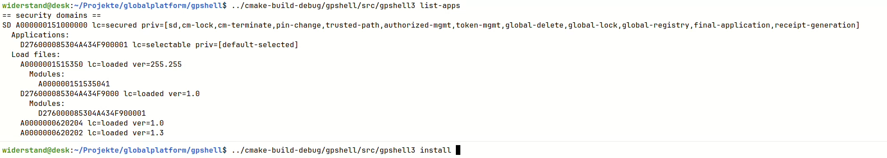

# Summary

This is the top level project for the GlobalPlatform library for providing access to OpenPlatform 2.0.1' and GlobalPlatform 2.1.1 conforming smart cards and later, the command line shell GPShell using the GlobalPlatform library and the PC/SC connection plugin for the GlobalPlatform Library.

# Pre-build Packages

There are Homebrew packages for [Linux and MacOS](https://github.com/kaoh/homebrew-globalplatform)

Windows binaries can be downloaded from the [GitHub release page](https://github.com/kaoh/globalplatform/releases) or from [SourceForge](https://sourceforge.net/projects/globalplatform/files/GPShell/).

# GPShell Manual

There are 2 versions of GPShell. The new GPShell 3+, using a concise, task-oriented command line, 
and the older GPShell 1+ using script files chaining multiple commands into one session.

Please read also the [manual of GPShell3](./gpshell/src/gpshell3.1.md) or if used 
the manual of the [manual of GPShell1](./gpshell/src/gpshell.1.md).

A quick demo video showcasing the most useful features in action:

[](https://youtu.be/MtZoTkrB41I)

For GPShell1+ there are several script examples available. See the [.txt files](./gpshell/examples) or look into the local file systems
under `/usr/share/doc/gpshell2` or `/usr/local/share/doc/gpshell2` or `home/linuxbrew/.linuxbrew/share/doc/gpshell2/`.

# Compilation

Clone the project from GitHub or download the zip file (also available under the Clone tab).

Consult the individual subprojects for further instructions and prerequisites. It is also possible to compile the sub projects individually.

## Prerequisites

Use a suitable packet manager for your OS or install the programs and libraries manually if applicable.

* Compiler Suite:
  * Linux: Termed `build-essential` in Debian based distributions (gcc, make)
  * macOS: Xcode
  * Windows: Visual Studio and SDK
* [CMake 3.10](http://www.cmake.org/) or higher is needed
* [PC/SC Lite](https://pcsclite.apdu.fr) (only for UNIXes, Windows and macOS are already including this)
* [Doxygen](www.doxygen.org/) for generating the documentation
* [Graphviz](https://graphviz.org) for generating graphics in the documentation
* [OpenSSL](http://www.openssl.org/) (Use OpenSSL 3)
* [zlib](http://www.zlib.net/) (macOS should already bundle this, for Windows a pre-built version is included)
* [cmocka](https://cmocka.org/) for running the tests
* [Pandoc](https://pandoc.org/installing.html) for generating the man page the tests

## Unix

Install the dependencies with `brew` or your distribution's package manager:

~~~shell
brew install openssl doxygen pandoc cmake cmocka zlib graphviz pcsc-lite
~~~

Ubuntu:

~~~shell
apt-get install libssl-dev doxygen cmake libcmocka0 zlib1g-dev graphviz pcscd libpcsclite-dev pkg-config
~~~


### Compile

__NOTE:__ If using Homebrew in parallel and having not used Homebrew for installing the dependencies but the distribution's package manager then several tools and libraries can be hidden by Homebrew or are not installed in Homebrew (`pkgconfig`, `PC/SC Lite`, `cmocka`, ...). One option is to install these tools and libraries with `brew` or remove the Homebrew path from the `PATH` variable temporarily
(which should be `./home/linuxbrew/.linuxbrew/bin:/home/linuxbrew/.linuxbrew/sbin`).

```
cd \path\to\globalplatform
cmake -B build -DCMAKE_BUILD_TYPE=Release.
cd build
make
make doc
make install
```

__NOTE:__ The Homebrew version of pcsc-lite is not a fully functional version. It is missing the USB drivers and is also not started as a system service. The distribution's version of pcscd should be installed. Under Linux the Homebrew version of pcsc-lite must be unlinked:

~~~
brew remove --ignore-dependencies pcsc-lite
~~~

## macOS

The compilation was executed on a system with [Homebrew](https://brew.sh) as a package manager.

Install the dependencies with `brew`:

~~~
brew install openssl@3 doxygen cmocka pandoc cmake graphviz
~~~


### Compile

It is necessary to set the `OPENSSL_ROOT_DIR`. In the case regarding the usage of Homebrew, this works:

```shell
cd \path\to\globalplatform
cmake -B build -DCMAKE_BUILD_TYPE=Release -DCMAKE_C_COMPILER=/usr/bin/gcc -DOPENSSL_ROOT_DIR=$(brew --prefix openssl@3) .
cd build
make
make install
```

__NOTE:__ `CMAKE_C_COMPILER` is required if Xcode is installed. CMake would favor the Xcode compiler, leading to potential runtime errors.

## Windows

Install the dependencies with [Chocolatey](https://chocolatey.org) in an administrator's PowerShell or install the dependencies manually:

~~~shell
choco install cmake doxygen.install graphviz
~~~

* For CMocka a pre-built version is used from the `cmock-cmocka-1.1.5` directory.
* For `zlib` a pre-built version is used the `zlib-1.2.8` directory.
* OpenSSL must be installed manually. Chocolatey is using the systems architecture, which is nowadays 64 bit, but the compilation needs the 32 bit version. Download [OpenSSL](https://slproweb.com/products/Win32OpenSSL.html) and choose the Win32 bit version and no light version.

### Compile

Launch Visual Studio Command Prompt / Developer Command Prompt / Developer PowerShell.

It will be necessary to set the `ZLIB_ROOT` and `CMOCKA_ROOT` and `OPENSSL_ROOT_DIR`. Use the pre-built versions of the project for convenience.

```shell
cd \path\to\globalplatform
cmake -G "NMake Makefiles" -DCMAKE_BUILD_TYPE=Release -DOPENSSL_ROOT_DIR="C:\Program Files (x86)\OpenSSL-Win32" -DZLIB_ROOT="C:\Users\john\Desktop\globalplatform\zlib-1.2.8\win32-build" -DCMOCKA_ROOT="C:\Users\john\Desktop\globalplatform\cmocka-cmocka-1.1.5\build-w32"
nmake
```

__NOTE:__ Read also the Windows-specific part in the [GlobalPlatform subproject](./globalplatform/README.md#sdk).

## Documentation

Execute:

    make/nmake doc

## Binary Packages

Execute:

    make/nmake package

## Source Packages

Execute:

    make/nmake package_source

## Debug Builds

To be able to debug the library, enable the debug symbols:

```
cmake -B build .
```

## Testing

To generate the tests, execute:

```shell
cmake -B build -DTESTING=ON -DINTEGRATION_TESTING=ON .
cd build
make
make test-unit
# with a recent JCOP test card with default keys
export OPGP_PLUGIN_PATH=$(pwd)/gppcscconnectionplugin/src
make test-integration
```

__NOTE:__ On Windows: When using the Visual Studio command line, the necessary mock functions are not supported by the linker and tests cannot be executed.

## Debug Output

The variable `GLOBALPLATFORM_DEBUG=1` in the environment must be set. The logfile can be set with `GLOBALPLATFORM_LOGFILE=<file>`. 
Under Windows by default `C:\Temp\GlobalPlatform.log` is chosen, under Unix systems if syslog is available it will be used by default. 
The default log file under Unix systems is `/tmp/GlobalPlatform.log` if syslog is not available.

# Packaging

cpack is used for packaging. 

If only GPShell is in focus, a static build is recommended:

~~~shell
cmake -B build -DCMAKE_BUILD_TYPE=Release -DSTATIC=ON
~~~

For the packaging process run inside the build directory after the build:

~~~shell
cpack
~~~

* On Linux, cpack creates both DEB and RPM. You need dpkg-deb and rpmbuild installed. 
* Windows MSI (WIX) is generated on Windows with WiX installed. 
* macOS DragNDrop is generated on macOS.

# Generate GitHub Documentation

The GitHub documentation is located under the `docs` folder and is using [Jekyll](https://jekyllrb.com).

Installation:

~~~shell
cd docs
gem uninstall jekyll
# select all
gem install jekyll -v 3.9.0
gem uninstall bundler
gem install bundler
bundle
bundle update github-pages
~~~


Useful commands inside the `docs` folder:

* Cleaning local generated site: `bundle exec jekyll clean`
* Serving site in a local browser updating automatically on content changes: `bundle exec jekyll serve`
* Update configuration in the Gemfile: `bundle update`

# Issues

For issues please use the [GitHub issue tracker](https://github.com/kaoh/globalplatform/issues).

You can also use the [Mailing List](https://sourceforge.net/p/globalplatform/mailman/) or ask a question on Stack Overflow assigning the tags `gpshell` or `globalplatform`.
