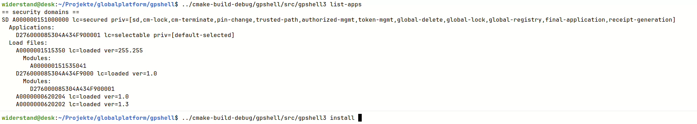

# Summary

GlobalPlatform is an open-source C library and command-line toolkit for
managing OpenPlatform 2.0.1 and GlobalPlatform 2.1.1 and later smart cards.
It includes the GlobalPlatform library, GPShell command-line tools, and a PC/SC
connection plugin.

Highlights:

- Complete GPShell3 SCP11a secure-channel workflow, including certificate,
  CA-KLOC, and elliptic-curve key-agreement provisioning.
- DAP signing and loading through DAP-verifying Security Domains.
- Delegated-management token workflows and receipt verification with AES, DES,
  RSA, and ECC keys.

# GPShell Manual

GPShell3 is the preferred, task-oriented command-line interface for interactive
use, shell scripts, and CI workflows. The legacy GPShell1 script interpreter
remains available for established `.txt` automation.

- [GPShell3 manual](./gpshell/src/gpshell3.1.md)
- [Legacy GPShell1 manual](./gpshell/src/gpshell.1.md)

## Script Examples

- GPShell1 scripts: [gpshell/examples/gpshell](./gpshell/examples/gpshell) (`.txt`)
- GPShell3 scripts: [gpshell/examples/gpshell3](./gpshell/examples/gpshell3) (`.sh`)

Installed examples are available under `/usr/share/doc/gpshell3/examples/`,
`/usr/local/share/doc/gpshell3/examples/`, or
`/home/linuxbrew/.linuxbrew/share/doc/gpshell3/examples/`.

A quick demo video showcasing the most useful features in action:

[](https://youtu.be/MtZoTkrB41I)

The current GPShell3 walkthroughs are collected in the
[GPShell YouTube playlist](https://www.youtube.com/watch?v=igqlIvuOB5o&list=PLg46pyBZ2z-wF8acSL1nWvWFU0WPmhwlD).

# Support and Consulting

Consulting for GlobalPlatform integration, smart-card deployment, and secure
channel workflows is available at [gpshell@ik.me](mailto:gpshell@ik.me).

# Installation

## GitHub Release Packages

Signed [GitHub Release packages](https://github.com/kaoh/globalplatform/releases)
are available for Windows (MSI, MSIX, and ZIP), Linux (DEB, RPM, and AppImage),
and macOS (DMG).

## vcpkg for C and CMake Projects

Use the [GlobalPlatform vcpkg registry](https://github.com/kaoh/globalplatform-vcpkg-registry)
to consume the library from C and CMake projects.

## Windows SDK

The release page provides signed x86 and x64 Windows shared-library SDK ZIPs.
They contain headers, import libraries, CMake package files, runtime DLLs, API
documentation, and a minimal CMake consumer example.

## Homebrew for Linux and macOS

Install the command-line tools and library from the
[Homebrew tap](https://github.com/kaoh/homebrew-globalplatform).

## Verifying the Signatures of the Signed Binaries

The PGP fingerprint for the verification is `8024 D2E1 6156 0548 7C2F 1D7B 04B6 C967 7A2F 2791`

~~~shell
wget https://github.com/kaoh/globalplatform/raw/master/release-key.asc
gpg --import release-key.asc
gpg --fingerprint
~~~

Ensure the fingerprint matches exactly.

~~~shell
gpg --verify SHA256SUMS.sig SHA256SUMS
sha256sum -c SHA256SUMS --ignore-missing
~~~

If the signature is BAD → do not use the files.

You should see also something like:

gpshell-3.0.0-static.deb: OK

# The Library And SDK

The [C API documentation](https://kaoh.github.io/globalplatform/api/index.html)
is generated from the release source. The library and its PC/SC plugin are
available as CMake packages for applications embedding GlobalPlatform.

Use the vcpkg registry for regular C/CMake integration. Native Windows
developers can instead use the signed shared-library SDK archives described
above.

# Compilation

Clone the project from GitHub or download the zip file (also available under the Clone tab).

Consult the individual subprojects for further instructions and prerequisites. It is also possible to compile the sub projects individually.

## Prerequisites

Use a suitable packet manager for your OS or install the programs and libraries manually if applicable.

* Compiler Suite:
  * Linux: Termed `build-essential` in Debian based distributions (gcc, make)
  * macOS: Xcode
  * Windows: Visual Studio and SDK
* [CMake 3.10](http://www.cmake.org/) or higher is needed
* [PC/SC Lite](https://pcsclite.apdu.fr) (only for UNIXes, Windows and macOS are already including this)
* [Doxygen](www.doxygen.org/) for generating the documentation
* [Graphviz](https://graphviz.org) for generating graphics in the documentation
* [OpenSSL](http://www.openssl.org/) (Use OpenSSL 3)
* [zlib](http://www.zlib.net/) (macOS should already bundle this, for Windows a pre-built version is included)
* [cmocka](https://cmocka.org/) for running the tests
* [Pandoc](https://pandoc.org/installing.html) for generating the man page the tests

## Unix

Install the dependencies with `brew` or your distribution's package manager:

~~~shell
brew install openssl doxygen pandoc cmake cmocka zlib graphviz pcsc-lite
~~~

Ubuntu:

~~~shell
apt-get install libssl-dev doxygen cmake libcmocka0 zlib1g-dev graphviz pcscd libpcsclite-dev pkg-config
~~~


### Compile

__NOTE:__ If using Homebrew in parallel and having not used Homebrew for installing the dependencies but the distribution's package manager then several tools and libraries can be hidden by Homebrew or are not installed in Homebrew (`pkgconfig`, `PC/SC Lite`, `cmocka`, ...). One option is to install these tools and libraries with `brew` or remove the Homebrew path from the `PATH` variable temporarily
(which should be `./home/linuxbrew/.linuxbrew/bin:/home/linuxbrew/.linuxbrew/sbin`).

```
cd \path\to\globalplatform
cmake -B build -DCMAKE_BUILD_TYPE=Release.
cd build
make
make doc
make install
```

__NOTE:__ The Homebrew version of pcsc-lite is not a fully functional version. It is missing the USB drivers and is also not started as a system service. The distribution's version of pcscd should be installed. Under Linux the Homebrew version of pcsc-lite must be unlinked:

~~~
brew remove --ignore-dependencies pcsc-lite
~~~

## macOS

The compilation was executed on a system with [Homebrew](https://brew.sh) as a package manager.

Install the dependencies with `brew`:

~~~
brew install openssl@3 doxygen cmocka pandoc cmake graphviz
~~~


### Compile

It is necessary to set the `OPENSSL_ROOT_DIR`. In the case regarding the usage of Homebrew, this works:

```shell
cd \path\to\globalplatform
cmake -B build -DCMAKE_BUILD_TYPE=Release -DCMAKE_C_COMPILER=/usr/bin/gcc -DOPENSSL_ROOT_DIR=$(brew --prefix openssl@3) .
cd build
make
make install
```

__NOTE:__ `CMAKE_C_COMPILER` is required if Xcode is installed. CMake would favor the Xcode compiler, leading to potential runtime errors.

## Windows

Install the dependencies with [Chocolatey](https://chocolatey.org) in an administrator's PowerShell or install the dependencies manually:

~~~shell
choco install cmake doxygen.install graphviz
~~~

* For CMocka a pre-built version is used from the `cmock-cmocka-1.1.5` directory.
* For `zlib` a pre-built version is used the `zlib-1.3.1` directory.
* OpenSSL must be installed manually. Chocolatey is using the systems architecture, which is nowadays 64 bit, but the compilation needs the 32 bit version. Download [OpenSSL](https://slproweb.com/products/Win32OpenSSL.html) and choose the Win32 bit version and no light version.

### Compile

Launch Visual Studio Command Prompt / Developer Command Prompt / Developer PowerShell.

It will be necessary to set the `ZLIB_ROOT` and `CMOCKA_ROOT` and `OPENSSL_ROOT_DIR`. Use the pre-built versions of the project for convenience.

```shell
cd \path\to\globalplatform
cmake -G "NMake Makefiles" -DCMAKE_BUILD_TYPE=Release -DOPENSSL_ROOT_DIR="C:\Program Files (x86)\OpenSSL-Win32" -DZLIB_ROOT="C:\Users\john\Desktop\globalplatform\zlib-1.3.1\win32-build" -DCMOCKA_ROOT="C:\Users\john\Desktop\globalplatform\cmocka-cmocka-1.1.5\build-w32"
nmake
```

__NOTE:__ Read also the Windows-specific part in the [GlobalPlatform subproject](./globalplatform/README.md#sdk).

## Documentation

Execute:

    make/nmake doc

## Binary Packages

Execute:

    make/nmake package

## Source Packages

Execute:

    make/nmake package_source

## Debug Builds

To be able to debug the library, enable the debug symbols:

```
cmake -B build .
```

## Testing

To generate the tests, execute:

```shell
cmake -B build -DTESTING=ON -DINTEGRATION_TESTING=ON -DSTATIC=ON .
cd build
make
make test-unit
# with a recent JCOP test card with default keys
export OPGP_PLUGIN_PATH=$(pwd)/gppcscconnectionplugin/src
make test-integration
```

__NOTE:__ On Windows: When using the Visual Studio command line, the necessary mock functions are not supported by the linker and tests cannot be executed.

## Debug Output

The variable `GLOBALPLATFORM_DEBUG=1` in the environment must be set. The logfile can be set with `GLOBALPLATFORM_LOGFILE=<file>`. 
Under Windows by default `C:\Temp\GlobalPlatform.log` is chosen, under Unix systems if syslog is available it will be used by default. 
The default log file under Unix systems is `/tmp/GlobalPlatform.log` if syslog is not available.

# Packaging

cpack is used for packaging. 

If only GPShell is in focus, a static build is recommended:

~~~shell
cmake -B build -DCMAKE_BUILD_TYPE=Release -DSTATIC=ON
~~~

For the packaging process run inside the build directory after the build:

~~~shell
cpack
~~~

* On Linux, cpack creates both DEB and RPM. You need dpkg-deb and rpmbuild installed. 
* Windows MSI (WIX) is generated on Windows with WiX installed. 
* macOS DragNDrop is generated on macOS.

There is a [GitHub Action workflow](.github/workflows/package-gpshell.yml) for creating the packages.

The produced artifacts are automatically attached to a draft release of the corresponding tag. 
The `SHA256SUMS` has to be signed manually:

~~~shell
gpg -u kaoh@users.noreply.github.com> --armor --detach-sign SHA256SUMS
~~~

# Generate GitHub Documentation

The GitHub documentation is located under the `docs` folder and uses
[Jekyll](https://jekyllrb.com). The checked-in `docs/Gemfile.lock` pins the
supported site dependencies; do not uninstall global gems, install a separate
Jekyll version, or run `bundle update` merely to serve the site locally.
Use Ruby 3.2 or newer: the locked `github-pages` dependency set requires it.

If `ruby --version` reports an older version, install a separate Ruby runtime
before continuing. For Debian or Ubuntu, the following uses `rbenv` without
changing the system Ruby or adding a `.ruby-version` file to the repository:

~~~shell
sudo apt install rbenv git build-essential libssl-dev zlib1g-dev libreadline-dev
mkdir -p "$(rbenv root)/plugins"
if [ -d "$(rbenv root)/plugins/ruby-build/.git" ]; then
  git -C "$(rbenv root)/plugins/ruby-build" pull --ff-only
else
  git clone https://github.com/rbenv/ruby-build.git "$(rbenv root)/plugins/ruby-build"
fi
rbenv install 3.3.7
eval "$(rbenv init - bash)"
rbenv shell 3.3.7
gem install bundler -v 2.3.10
~~~

After this setup, `ruby --version` must report the selected Ruby version and
`command -v bundle` must resolve to an `rbenv` shim, not a previously installed
system-wide gem directory. The maintained user-local `ruby-build` plugin is
used because distribution packages may contain outdated Ruby version definitions.

To test the site without changing globally installed Ruby gems:

~~~shell
cd docs
unset GEM_HOME GEM_PATH
export BUNDLE_PATH=/tmp/globalplatform-jekyll-bundle
bundle install
bundle exec jekyll serve --host 127.0.0.1 --port 4000 --no-watch
~~~

Open [the local documentation site](http://127.0.0.1:4000/) in a browser. The
GPShell3 AI prompt assistant is available at
[http://127.0.0.1:4000/ai-assistant/](http://127.0.0.1:4000/ai-assistant/).
The `--no-watch` mode avoids Linux inotify resource limits and is sufficient for
local testing. Restart the server after documentation changes. On systems with
available inotify capacity, omit `--no-watch` and add `--livereload` to rebuild
and refresh pages automatically.

Useful commands inside the `docs` folder after setting `BUNDLE_PATH`:

* Build the generated site once: `bundle exec jekyll build`
* Clean local generated site output: `bundle exec jekyll clean`
* Update locked dependencies intentionally: `bundle update` followed by review
  of `Gemfile.lock`

# Issues

For issues please use the [GitHub issue tracker](https://github.com/kaoh/globalplatform/issues).

You can also use the [Mailing List](https://sourceforge.net/p/globalplatform/mailman/) or ask a question on Stack Overflow assigning the tags `gpshell` or `globalplatform`.
