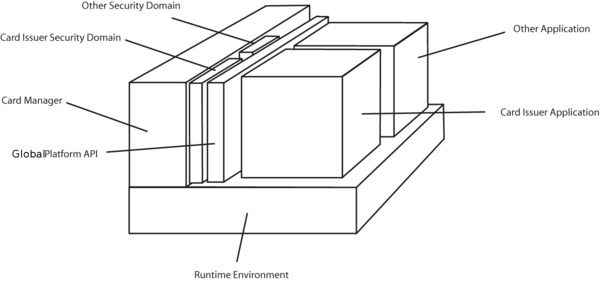
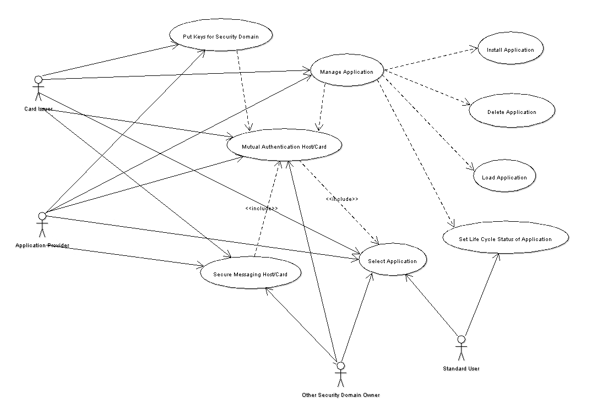
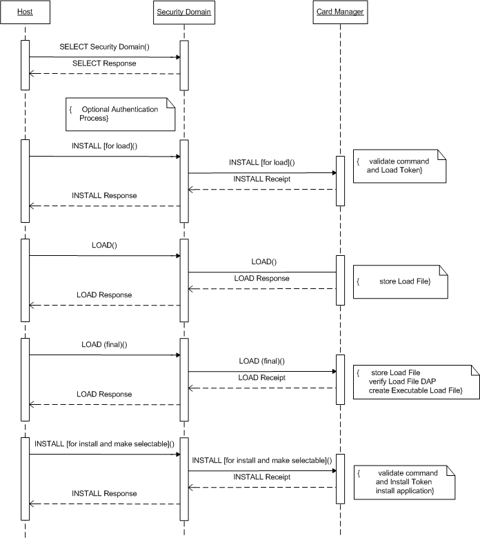

# GlobalPlatform Specification

The [GlobalPlatform](http://www.globalplatform.org/) card specification is a standard for the
management of the infrastructure of a smart card. This management comprises the installation, the
removal of applications and additional management tasks on a card. The main authority for this is the card
issuer, which has full control over the card contents, but he can grant also other institutions to
administrate their own applications. This management is achieved by applying cryptographic
protocols, which authenticate and encipher these processes.
The Open Platform specification should enable multi application capable smart cards which can be
joined by multiple institutions where all installations are authorized by the card issuer and each
institution has its own secure area on the card.

# Overview over Architecture #

# Runtime Environment #

GlobalPlatform can be built on top of every multi application capable runtime environment. In practice
the runtime environment is always the Java Card Runtime Environment.

# Security Domain #

A Security Domain is a protected area on a smart card. To this Security Domain are assigned
applications, which can use cryptographic services it offers. By default only the Security Domain of the
card issuer exists on a card. If another institution wants to have its own Security Domain, e.g. for
having its own secure application environment or managing its own applications, such a domain can
be created with the help of the card issuer. Institutions managing their own applications are also
referred to as Application Providers.

# Card Manager #

The card manager is the central component of a GlobalPlatform card. Every service is executed by it and it
offers interfaces to use its services internal through the GlobalPlatform API and external through APDU
commands. In addition the Card Manager includes the Security Domain of the card issuer, due to the
fact that it can also own applications on the card.

# GlobalPlatform API #

The GlobalPlatform API gives applications on the card access to certain management functions of the
Card Manager and the possibility to authenticate the communication partner and using a secure
channel with it within the current active Security Domain.

# Concepts and Functionality #

For a use case diagram illustrating the common usages see the following figure:

# Mutual Authentication and Negotiated Security Level #

To access the management functions of a card it is necessary to authenticate the host and the card
against each other. Only in an early life cycle state of teh card, this is not necessary. If the Security
Domain of the card issuer is not the default selected application or another Security Domain should be
the context of the communication session it must be chosen by executing a SELECT command, which
must be given the AID of the Security Domain. An AID is a hexadecimal identifier for application
concerning card content. The most common default AID of the Security Domain of the card issuer is A0 00 00 00 03 00
00 00.

Each Security Domain owns at least a set of three 3DES keys, the Secure Channel Keys, which must
also be known to the host system. These three keys are the Encryption Key, which is used to generate a
encryption session key for encrypting the transmitted messages, the Message Authentication Key, to
generate a MAC session key for ensuring the integrity of transmitted messages and the Key Encryption
Key to encrypt newly transferred keys. The first command sent to the card is the INITIALIZE UPDATE
command. The INITIALIZE UPDATE command transmits a random number and states which key set
version should be used during the following session and at which key index the three successive keys
are found. The values 0 for the key set version and 0 for the key index are used to denote the first
available keys.
The random number is encrypted with the Encryption Key in 3DES ECB mode and the resulting card
cryptogram is sent back with an own random number to challenge the host. If the card cryptogram is
verified successfully the host encrypts the random number of the card also in 3DES in ECB mode and
sends the host cryptogram back in an EXTERNAL AUTHENTICATE command. The card verifies also
this host cryptogram. With the EXTERNAL AUTHENTICATE command the host proposes a security
level during the communication of this session. This security level can be plain text, where no integrity
or confidentiality is given, the integrity of each message can be protected by appending a MAC using
the MAC session key or in addition to the integrity also the confidentiality of the messages can be
assured by using the encryption session key.

# Loading, Installation and Removal of contents #

The most noticeable task is the management of the card content. These are the loading, the installation
and the removal of card contents. These tasks are performed in the context of a Security Domain.

## Loading and Installation ##

The complete loading and installation happens in four steps:

## INSTALL \[for load\] ##

The INSTALL \[for load\] command prepares the card to a following LOAD
command. With this command the AID of the Load File Data Block is transmitted and the AID of the
Security Domain, in which the Load File Data Block will be installed. A Load File Data Block is a data
block, which contains one or more applications or libraries. In the case of the Java Card Runtime
Environment this is equivalent to a package which can be saved in a format like the CAP format or the
more common IJC format. Also parameters concerning the resource allocation on the card are
indicated. These are the necessary space for storing the Load File Data Block referred to as Non Volatile
Code Space Limit, the needed space of persistent memory to store the resulting data of the application,
referred to as Non Volatile Data Space Limit and the amount of volatile memory space, which is
needed during execution of the application, referred to as Volatile Data Space Limit. The most cards are
only interested in the Non Volatile Code Space Limit. Optional a Load File DAP can be given. A Load
File DAP is a hash to verify to correct transmission of a Load File. To accomplish this the whole Load
File is hashed by SHA-1. A Load File can contain in addition to a Load File Data Block prefixed Load
File Data Block DAPs. The point DAP Verification and Mandated DAP Verification should clarify this.
If all given arguments are checked, which is the case, if no content on the card has the same AID like
this Load File Data Block, the associated Security Domain does exist and the requested resource
allocations can be satisfied.

## LOAD ##

The LOAD command transfers the Load File in one or multiple messages depending on the
Load File size to the card. If a Load File DAP was contained in the INSTALL \[for load\] command, the
validity of this hash is verified. From the contained Load File Data Block a so called Executable Load
File is created with the same AID as the Load File Data Block. An entry of the Executable Load file is
created in the registry of the Card Manager and its associated Security Domain. The registry contains
information of all installed contents, its privileges and its associated Security Domains.

## INSTALL \[for install\]

This command installs an application from an Executable Load File. Therefor
the AID of the Load File Data Block, which is the Executable Load File, the AID of the to be installed
content in the Executable Load File and the intended AID of application instance is declared. The to be
installed content equals in the context of the Java Card an applet class. The AID of the application
instance corresponds to the AID of the applet class instance which is running the whole card life and
which is used to select the application. In addition the resource concerning parameters like in
INSTALL \[for load\] for the application are given. Most cards are only interested in the amount of the
Non Volatile Data Space Limit. Another mandatory argument are the application privileges. Some
notable privileges here are the Security Domain privilege, which states that the installed application is
a Security Domain and the privilege, that the application is the default selected application, which
means that it is selected implicitly by connecting to a card. Other privileges are mentioned in the
following paragraphs. To the installed application a maximum of 32 bytes of install parameters can be
passed. In the Java Card terminology the install method of the applet is called with these parameters. If
the Executable Load File is existent on the card, the application is contained in the Executable Load
File, the application instance AID is not used by another content on the card and the resource
requirements can be satisfied, the Card Manager creates an application from the Executable Load File,
an entry for the application instance in the registry and associates its Security Domain.

## INSTALL \[for make selectable\]

The INSTALL \[for make selectable\] command makes the application
available to be selected. The AID of the application instance and the applet privileges are required. If
the AID exists the application instance is marked as SELECTABLE in its life cycle status. A life cycle
state of an application defines the selectable state of an application. E.g. after the INSTALL \[for install\]
command the application is in the state INSTALLED. A complete overview of the life cycle states is
given in the paragraph Life Cycle Management.
The last to steps can be combined in a INSTALL \[for install and make selectable\] command.

## Removal ##

## DELETE ##

A DELETE command deletes a content on a card by its AID. Before this is done it is checked
if the AID exists in the registry and if this content is not referenced by another installed content on the
card. E.g. installed applications depend on their Executable Load File. If the content can be deleted its
entry is removed form the registry and all persistent is marked as available.

# Delegated Management #

By default only the Security Domain of the card issuer is allowed to load,
install and remove contents on a card. To enable also other Application Providers with their Security
Domain on the card to manage their contents the privilege of Delegated Management was introduced.
This privilege must be given to the Security Domain by installation time. In order that the card issuer
keeps the control of the card each content change must be authorized by him. Each content which is
loaded and installed on a card must be signed by a digital signature of the card issuer. The loading of
content is granted by the verification of a Load DAP, also referred to as Load Token, during the
INSTALL \[for load\] phase. The installation of content is granted by the verification of a Install DAP,
also termed Install Token, in the INSTALL \[for install and make selectable\] command. Separate
INSTALL \[for install\] and INSTALL \[for make selectable\] commands are not possible. These DAPs are
calculated with RSA PKCS#1 over the parameters given in the INSTALL \[for install and make
selectable\] command. To verify the signature the Security Domain of the card issuer must has access to
a public RSA key, referred to as Token Key. In the case of a DELETE command no DAP is necessary.
The execution of the loading, installation and removal is confirmed by the return of the Receipt. A
Receipt is the proof to the card issuer that the owner of the Security Domain with Delegated
Management privilege has carried out the operation. The Receipt is a MAC with a variation of 3DES in
CBC mode. To calculate this Receipt the Security Domain of the card issuer must know a 3DES key for
the Receipt generation. This key is termed Receipt Key. There is one Receipt type according to each
loading and installation process. Every Receipt signs some card unique data together with a
confirmation counter. The card unique data is some data which makes this card distinguishable from
other cards. The confirmation counter assures that no former Receipt can be used to forge the
confirmation. The Load Receipt signs in addition the Executable Load File AID created by the LOAD
command and the associated Security Domain AID. The Install Receipt signs also the Executable Load
File AID and the application instance AID. The computation of the Delete Receipt include the AID of
the deleted content.

# DAP Verification and Mandated DAP Verification #

DAP Verification permits another institution as
the card issuer to verify the integrity of a Load File Data Block. This can be useful if a Security Domain
has not the ability to load content to the card or if a controlling entity may require that all content is
certified. At installation time the Security Domain must obtain the DAP Verification privilege and after
its installation a DAP Verification Key, a 3DES key or public RSA key, must be deposited in it to verify
the integrity of the loaded content. To check the integrity a Load File Data Block DAP must be created
by calculating a digital signature with RSA PKCS#1 or a MAC with a variation of 3DES in CBC mode
over the Load File Data Block. The result of this operation is also called DAP Block. This DAP Block is
prefixing the Load File Data Block and transferred as Load File with the LOAD command. The DAP
Block is verified by the Security Domain with its key. If the DAP Block is valid the loading is granted.
The difference between DAP Verification and Mandated DAP verification is that the Card Manager
only contacts the Security Domain with the first privilege if the Security Domain is the associated
Security Domain of the content to be loaded while a Security Domain with the second privilege must
always verify the content which is loaded to the card.

# Key Management #

To support the management function a variety of keys are necessary. Apart from the mandatory
Encryption Key, Message Authentication Key and Key Encryption Key the Security Domain of the card
issuer can have a Token Key and a Receipt Key, referred to as Delegated Management Keys, to support
Delegated Management. A Security Domain or another institution can have a DAP Verification Key.

## PUT KEY ##

The PUT KEY command is used to populate the Security Domain with keys or replace
existing keys. The pure Open Platform specification does not provide a way to delete keys. Beneath the
possibility to put or replace Secure Channel and Delegated Management Keys, single keys can also be
managed. The PUT KEY command must be passed one or multiple keys, the key set version in which
the key(s) should be added or replaced and the key index within this key set version where the first key
should be stored. For Delegated Management Keys there may be restriction on the key set version
number. On some card it is possible to view key information or delete keys. If the card does not offer a
way of deleting keys and view key information the tracking of available keys is the responsibility of the
owner of the Security Domain.

## Viewing Key Information ##

If a card supports the retrieval of key information the GET DATA
command is used to obtain key information templates of the selected Security Domain. Key
information templates contain the key set version number the key belongs to, the key index of the key
and the key type.

# DELETE \[key\] #

Another optional enhancement is the deletion of keys in a Security Domain.
Necessary parameters are the key set version number and the key index. It is possible to delete a whole
key set version by giving the key set version number and a key set index of zero. The same is possible
for keys with the same key index by giving a key set version number of zero.

# Life Cycle Management #

To reply to security violations each application, Executable Load File and the Card Manager has a life
cycle state.

For the card issuer Security Domain those values can be OP READY, INITIALIZED, SECURED, LOCKED and
TERMINATED. The difference between OP READY and INITIALIZED is only administrative and both
mean, that the card is ready for receiving command, but is not ready for card holder. The state
INITIALIZED can mean that already a key set version is installed. The state SECURED means that the
card is ready for the card holder. A key set version is installed and all communication must take place
in a secure channel. The last three states are irreversible. The state LOCKED may mean that a
security violation has occurred and no application except the Card Manager can be selected and no key
and content change is allowed to happen. The state TERMINATED means the end of the life of the card
and the card shall only respond to a GET DATA command. Usually only the Security Domain of the
card issuer can lock or terminate the card. Other Security Domains must have the Card Manager Lock
privilege and Card Terminate privilege respectively.

An Executable Load File can only be in the state LOADED.

An application has three possible life cycle states. These are INSTALLED, SELECTABLE and
LOCKED. If an application should not be selectable the application can be LOCKED. An application can only be unlocked by its Security Domain.

A Security Domain can be in state INSTALLED, SELECTABLE, PERSONALIZED and LOCKED.
The state PERSONALIZED means that the Security Domain is equipped with some personal content like keys.
A Security Domain can be associated with content in this state. For a
Security Domain the state LOCKED means, that only the Security Domain of the card issuer can unlock
it.

## GET STATUS ##

With this command the life cycle status of the Card Manager, Executable Load Files
and applications can be obtained. Additional the application privileges are returned.

## SET STATUS ##

The command SET STATUS is used to set the life cycle state of an installed content. The
AID of the card content to set the life cycle state must be given. Some life cycle states can only be set
with a method of the Open Platform API by an application on the card.

# Card Data #

There is a variety of card data objects. The Open Platform specification proposes only that the CPLC
data should be retrievable. CPLC is an abbreviation for Card Production Life Cycle. This data object
contains information about the production process of the card like the operating system or the ICC
manufacturer. The Card issuer BIN data contains usually the serial number of the card. Apart from that
the user defined Card issuer data can be used e.g. for deriving the keys. Some other possible values can
be the available resources like EEPROM space.

## GET DATA ##

The GET DATA command is used to retrieve the above data. Each card data object has a
tag name which is used to access it.

## PUT DATA ##

Possible writable data can be stored with the PUT DATA command. The same tag names
for the card data objects like in GET DATA are used.
