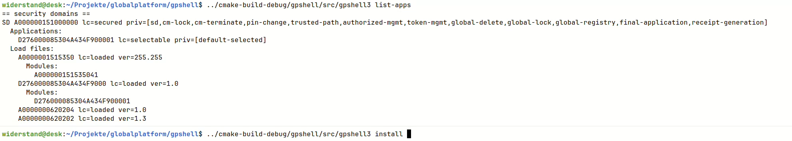

# Summary

GPShell (GlobalPlatform Shell) is a script interpreter which talks to a smart card.  It is written on top of the GlobalPlatform library.
It uses smart card communication protocols ISO-7816-4 and OpenPlatform 2.0.1 and GlobalPlatform 2.1.1 and later.
It can establish a secure channel with a smart card, load, instantiate, delete, list applications and manage keys on a smart card.

__!!!!!!!!!!!!!!!!!!!!!!!!!!!!!!!!!!!__

__PLEASE OBEY THAT EVERY CARD GETS LOCKED AFTER A FEW (USUALLY 10) UNSUCCESSFUL MUTUAL AUTHENTICATIONS.
THE CONTENTS OF A LOCKED CARD CANNOT BE MANAGED ANYMORE (DELETED, INSTALLED)!!!
IF YOU EXPERIENCE SOME UNSUCCESSFUL MUTUAL AUTHENTICATION ATTEMPTS FIRST EXECUTE A SUCCESSFUL MUTUAL AUTHENTICATION WITH A KNOWN WORKING PROGRAM
TO RESET THE RETRY COUNTER BEFORE YOU PROCEED WITH GPSHELL. CHECK THE PARAMETERS FOR MUTUAL AUTHENTICATION (KEYS, SECURITY PROTOCOL) AND ASK IF ANYBODY KNOWS IF THE CARD IS SUPPORTED.__

__!!!!!!!!!!!!!!!!!!!!!!!!!!!!!!!!!!!__

# Pre-build Packages

Prebuild packages for Windows are provided in the [release page](https://github.com/kaoh/globalplatform/releases) as MSI, MSIX and ZIP.

Prebuild packages for Linux are provided in the [release page](https://github.com/kaoh/globalplatform/releases) as DEB, RPM and AppImage.

Prebuild packages for macOS are provided in the [release page](https://github.com/kaoh/globalplatform/releases) as DMG.

There are Homebrew packages for [Linux and macOS](https://github.com/kaoh/homebrew-globalplatform).

# Execution

There are 2 versions of GPShell. The new GPShell 3+, using a concise, task-oriented command line, 
and the older GPShell 1+ using script files chaining multiple commands into one session.

__NOTE:__ You also need at least one connection plugin, e.g., the shipped `gppcscconnectionplugin` to use PC/SC, which is bundled by default, so there is no need to worry.
However, it is possible to implement a different communication channel, e.g., tunneling over TCP/IP.
Existing solution like [pcsc-relay](https://frankmorgner.github.io/vsmartcard/pcsc-relay/README.html) might be a quicker solution.

## GPShell 3+

Several quick demo videos showcasing the most useful features in action:

[](https://youtu.be/MtZoTkrB41I)

Other advanced features:

* [Delegated Management and Receipts with ECC](https://youtu.be/jnyjurH8yyE)
* [Security Domain Management](https://www.youtube.com/watch?v=SSFotz3p30k)
* [DAP Functionality](https://youtu.be/WhlAlZTJ_5c)
* [Card Data](https://youtu.be/IcLAxSBznfM)

### Command Line Documentation

Read the [GPShell3 man page](./src/gpshell3.1.md) for all commands and their options or use `man gpshell3` under Linux or macOS.

### MacOS

For macOS you might set:

      export DYLD_LIBRARY_PATH=/opt/local/lib

so that all needed libraries are found.

## GPShell 1+

### Example Script Files

In the [examples directory](./examples) of this project:

- [examples/gpshell](./examples/gpshell) contains legacy GPShell1 `.txt` script examples.
- [examples/gpshell3](./examples/gpshell3) contains GPShell3 `.sh` examples.

After installation these examples can be found under:

- `/usr/share/doc/gpshell3/examples/`
- `/usr/local/share/doc/gpshell3/examples/`
- `/home/linuxbrew/.linuxbrew/share/doc/gpshell3/examples/`

### Command Line Documentation

Read the [GPShell1 man page](./src/gpshell.1.md) for all commands and their options or use `man gpshell` under Linux or macOS.

### macOS

For macOS you might set:

      export DYLD_LIBRARY_PATH=/opt/local/lib

so that all necessary libraries are found.

# Compilation

For further detailed instructions also consult the `README.md` from the `globalplatform` sub project.

## Prerequisites

Use a suitable packet manager for your OS or install the programs and libraries manually if applicable.

* Compiler Suite:
  * Linux: Termed `build-essential` in Debian based distributions (gcc, make)
  * MacOS: Xcode
  * Windows: Visual Studio and SDK
* [CMake 3.10](http://www.cmake.org/) or higher is needed
* [PC/SC Lite](https://pcsclite.apdu.fr) (only for UNIXes, Windows and MacOS is already including this)
* [zlib](http://www.zlib.net/) (MacOS should already bundle this, for Windows a pre-built version is included)
* [GlobalPlatform](https://github.com/kaoh/globalplatform)

## Unix/MacOS

On a command line type:

```
cd \path\to\globalplatform
cmake .
make
make install
```

## Windows

Launch Visual Studio Command Prompt / Developer Command Prompt / Developer PowerShell:

```
cd \path\to\globalplatform
cmake -G "NMake Makefiles"  
nmake
```

## Source Packages

Execute:

    make/nmake package_source

## Binary Packages

Execute:

    make/nmake package

## Debug Builds

To be able to debug the library enable the debug symbols:

cmake -DDEBUG=ON


## Man Page (Only for UNIXes)

The man page is translated with [pandoc](https://pandoc.org) from markdown to groff syntax. To render a preview of the result use:

~~~shell
cd src
pandoc --standalone --to man gpshell.1.md | groff -man -Tascii
pandoc --standalone --to man gpshell3.1.md | groff -man -Tascii
~~~

## Debug Output

If you experience problems a DEBUG output is helpful.
The variable `GLOBALPLATFORM_DEBUG=1` in the environment must be set. The log file can be set with `GLOBALPLATFORM_LOGFILE=<file>`. Under Windows by default `C:\Temp\GlobalPlatform.log` is chosen. The log file must be writeable for the user.
Under Unix systems if syslog is available it will be used by default.
 The default log file under Unix systems is `/tmp/GlobalPlatform.log` if syslog is not available or cannot be written by the user. If you don't have access to the syslog or don't want to use it you can still set the
`GLOBALPLATFORM_LOGFILE` manually. Keep in mind that the debugging output may contain sensitive information, e.g. keys!
